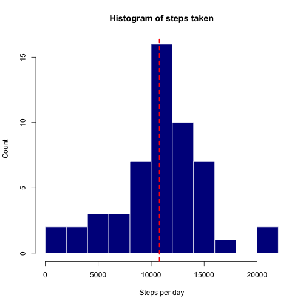
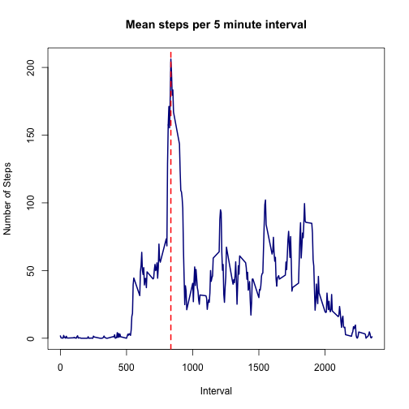
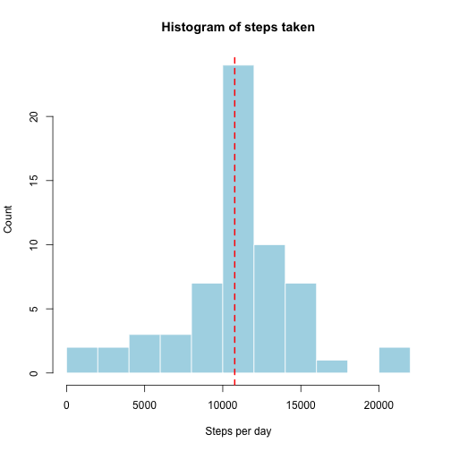
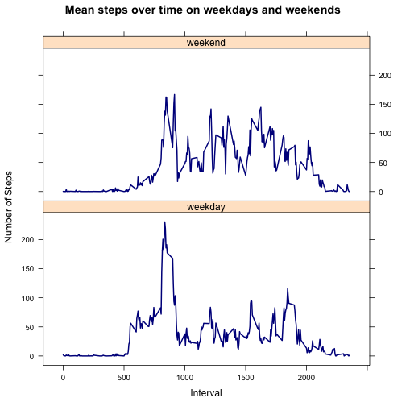

#Activity Monitoring Data Analysis
[Date: May 4 2016 | Author: JS]

It is now possible to collect a large amount of data about personal movement using activity monitoring devices such as a Fitbit, Nike Fuelband, or Jawbone Up. These type of devices are part of the “quantified self” movement – a group of enthusiasts who take measurements about themselves regularly to improve their health, to find patterns in their behavior, or because they are tech geeks. But these data remain under-utilized both because the raw data are hard to obtain and there is a lack of statistical methods and software for processing and interpreting the data.

This R Markdown file explicates the steps required to analyse data from a personal activity monitoring device. The analysed data set includes data collected at 5 minute intervals through out the day. The data consists of two months of data from an anonymous individual collected during the months of October and November, 2012 and include the number of steps taken in 5 minute intervals each day.

###*Loading and preprocessing the data*
The following code will load the data and add a 'DT' column to the 'data' dataframe that represents the date in POSIXlt format.


```r
data <- read.csv("/users/jshemmell/desktop/Data Science Course 2016/activity.csv")
```

###*What is mean total number of steps taken per day?*
Here is the code used to calculate first the mean number of steps on each day and then the mean number of steps in total across all days of data collection.


```r
steps_day <- aggregate(steps~date, data=data, FUN="sum")
```

Below is a histogram of the mean number of steps taken on a given day.


```r
mean_steps_day <- round(mean(steps_day$steps), digits = 0)
median_steps_day <- round(median(steps_day$steps), digits = 0)
mean_median_diff <- mean_steps_day - median_steps_day
hist(steps_day$steps, breaks = 10, col = "darkblue", border = "white", main = "Histogram of steps taken", xlab = "Steps per day", ylab = "Count")
abline(v=mean_steps_day, col = "red", lwd = 2, lty = 2)
```



In this data set, the **mean** number of steps taken per day is **1.0766 &times; 10<sup>4</sup>** (red dashed line on histogram), while the **median** is **1.0765 &times; 10<sup>4</sup>**. The mean and median values differ by **1**.

###*What is the average daily activity pattern?*
Below, the average number of steps (across all days) is plotted for each five minute data recording period.  

```r
timeSteps <- aggregate(steps~interval, data=data, FUN = "mean")
plot(timeSteps, type = "l", main = "Mean steps per 5 minute interval", ylab = "Number of Steps", xlab = "Interval", lwd = 2, col = "darkblue")
time_of_max <- timeSteps[timeSteps$steps == max(timeSteps$steps), 1]
abline(v=time_of_max, col = "red", lwd = 2, lty = 2)
```



On average across all days, the maximum number of steps was taken during the **835th** 5 minute recording period (red dashed line on plot). 

###*Imputing missing values*

The code below calculates the total number of NAs in the dataset and replaces NAs with the average number of steps taken in the corresponding time period across the rest of the days. A new dataset called 'fulldataset' is produced in which all missing values are replaced with the appropriate mean value.  

```r
total_NAs <- sum(is.na(data))
fulldataset <- data
for (i in 1:dim(data)[1]){
        if (is.na(data$steps[i])==T) {
                fulldataset$steps[i] <- timeSteps$steps[timeSteps$interval==data$interval[i]]
        }
}
```

The total number of time points at which there is missing data is **2304**. A histogram of the total steps taken per day is shown below, with the mean represented by a red dashed line. 


```r
steps_day2 <- aggregate(steps~date, data=fulldataset, FUN="sum")
mean_steps_day2 <- round(mean(steps_day2$steps), digits = 0)
median_steps_day2 <- round(median(steps_day2$steps), digits = 0)
mean_median_diff2 <- mean_steps_day2 - median_steps_day2
hist(steps_day2$steps, breaks = 10, col = "lightblue", border = "white", main = "Histogram of steps taken", xlab = "Steps per day", ylab = "Count")
abline(v=mean_steps_day2, col = "red", lwd = 2, lty = 2)
```



In the data set without missing values, the **mean** number of steps taken per day is **1.0766 &times; 10<sup>4</sup>** (red dashed line on histogram), while the **median** is **1.0766 &times; 10<sup>4</sup>**. The mean and median values now differ by **0**.

###*Are there differences in activity patterns between weekdays and weekends?*
The code below categorises the data set according to whether data were collected on weekdays or weekends.


```r
fulldataset$weekday <- weekdays(strptime(fulldataset$date, format = "%Y-%m-%d"))
WeekDays <- c("Monday", "Tuesday","Wednesday","Thursday","Friday")
for (point in 1:dim(fulldataset)[1]) {
        if (sum(fulldataset$weekday[point] == WeekDays) == 1) {
            fulldataset$weekday[point] <- "weekday"
        } else {
                fulldataset$weekday[point] <- "weekend"
        }
}
```

This plot presents the number of steps taken over time on weekends (upper plot) versus weekdays (lower plot). On average, more steps were taken on weekend days (42.4) than weekdays (35.6). Steps are taken more consistently across weekend days, whereas a sharp increase in the number of steps taken around intervals 800-950 dominates the weekday data.


```r
library(lattice)
timeSteps2 <- aggregate(steps~interval+weekday, data=fulldataset, FUN = "mean")
meansteps <- aggregate(steps~weekday, data=timeSteps2, FUN="mean")
xyplot(timeSteps2$steps~timeSteps2$interval|timeSteps2$weekday, type = "l", main = "Mean steps over time on weekdays and weekends", ylab = "Number of Steps", xlab = "Interval", lwd = 2, col = "darkblue", layout = c(1,2))
```


